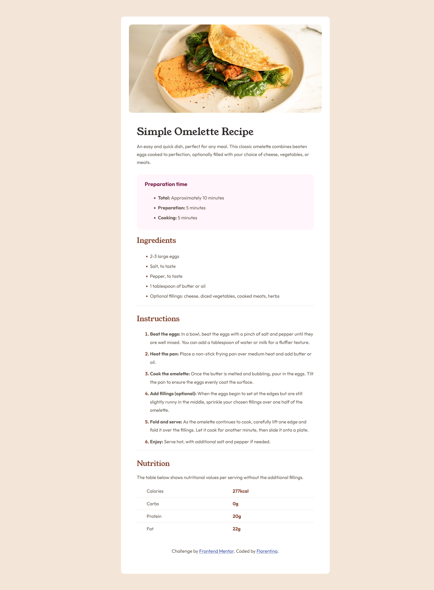

# Frontend Mentor - Recipe page solution

This is a solution to the [Recipe page challenge on Frontend Mentor](https://www.frontendmentor.io/challenges/recipe-page-KiTsR8QQKm). Frontend Mentor challenges help you improve your coding skills by building realistic projects.

## Table of contents

- [Overview](#overview)
  - [The challenge](#the-challenge)
  - [Screenshot](#screenshot)
  - [Links](#links)
- [My process](#my-process)
  - [Built with](#built-with)
  - [What I learned](#what-i-learned)
  - [Continued development](#continued-development)
- [Author](#author)

## Overview

### The Challenge

The challenge is to build a recipe page and get it looking as close to the design as possible.

### Screenshot

### Links

- Solution URL: [Add solution URL here](https://your-solution-url.com)
- Live Site URL: [Add live site URL here](https://your-live-site-url.com)

## My process

### Built with

- Semantic HTML5 markup
- CSS custom properties
- Flexbox
- Mobile-first workflow

### What I learned

I attempted designing a webpage using mobile-first workflow for the first time, I gained more experience in implementing media queries for responsiveness.
I also learned how to use the marker pseudo functionality to style just the markers of a list and gained more experience creating reusable css classes for styling.

### Continued development

I would like to improve on my mobile-first workflow while designing websites, I also want to get more comfortable with media queries. As time goes on I intend to use javascript frameworks to design the challenges.

## Author

- Website - [Florentina Antigha](https://florentinaantigha.vercel.app/)
- Frontend Mentor - [@Floren-teena](https://www.frontendmentor.io/profile/Floren-teena)
- Twitter - [@Floren\_\_teeena](https://twitter.com/Floren__teeena)
